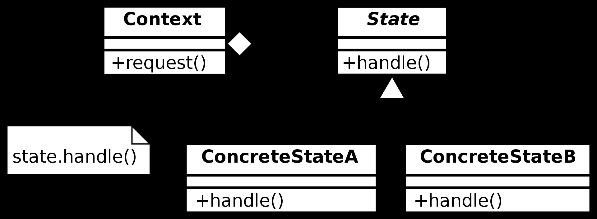

= State Pattern（状态模式）

== 定义
行为型设计模式之一，State Pattern 允许对象在内部状态变化时，变更其行为，并且修改其类。

== UML

== 优点
* 定位指定状态的行为，并且针对不同状态来划分行为，使状态转换显示进行。

=== 以下场景考虑使用 State Pattern
1. 对象的行为依赖于其状态，并且该对象必须在运行时根据其状态修改其行为
2. 操作具有大量以及多部分组成的取决于对象状态的条件语句（如switch...case，if等）
